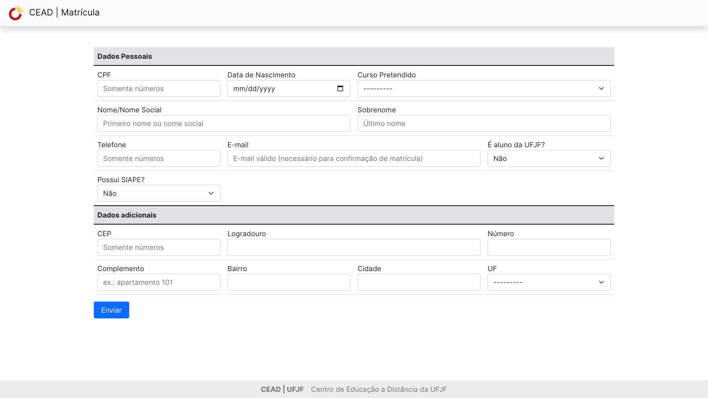

# Inscrições de alunos na plataforma Moodle Cead
---
O sistema em questão é responsável pelo preenchimento do formulário do aluno em cursos pré cadastrados na base de dados do CEAD.

## Instruções Básicas
Criar os diretórios **outputs**, **scripts** e **uploads** na raiz do projeto.

```python
pip install -r requirements/requirements.txt
```

Solicitar ao Desenvolvimento o arquivo **config.json** que deve ser inserido na pasta *scripts*.

```python
python src/manage.py migrate
```

```python
python src/manage.py runserver
```

A primeira parte dos comandos acima podem variar conforme a versão do *pip* e do *python* de sua máquina (Ex.: pip3, python3.10, python3.11, etc...)

## Armazenamento dos dados
Ao fim do seu cadastro são gerados arquivos de inserção em banco de dados nos modelos MySQL e SQL, além de um modelo NoSQL, em .json, para controle interno, e um arquivo .csv contendo os dados necessários para cadastro no sistema pela equipe de suporte do CEAD.

## Envio das informações
O sistema cria e encaminha via e-mail uma senha de 8 caracteres contendo, no mínimo, um caracter em letra maiúscula, um caracter em letra minúscula, um dígito numérico e um símbolo, conforme a recomendação do Moodle para criação de senhas.
Os detalhes para acesso à plataforma são enviados ao aluno via e-mail.

### Aparência do Formulário
